# 🧶 Charl: Technology That Feels Like Magic


<a href="https://deploy.workers.cloudflare.com/?url=https://github.com/cloudflare/agents-starter"></a>

**Technically**, Charl is a cloud-native orchestration platform for **OpenClaw** agents.
**Psychologically**, it is the end of "DevOps Anxiety."

> "The best interface is no interface. The best configuration is a conversation."

---

## The Problem with "Smart" Tools

Most AI agents are like eager interns who refuse to tie their own shoelaces. They are undeniably smart, yet completely helpless. You have to configure them, deploy them, manage their environments, and restart them when they trip over a missing API key.

We asked a simple question: **Why can't the intern just tie their own shoes?**

## The Solution: OpenClaw

When you deploy **Charl**, you aren't just deploying software. You are hiring a fleet of **OpenClaw** agents who are biologically designed to manage themselves.

### 🌟 The "End of Friction" Workflow

Forget `ssh`, `vim`, and `.env` files. If you want to change OpenClaw's configuration, you don't act like a systems administrator. You act like a boss.

You simply say:

> **You:** "We've switched to the new Claude Sonnet model. Please update yourself."
>
> **OpenClaw:** "Consider it done."

And here is where the alchemy happens:
1.  The agent **writes its own config file**.
2.  The agent **restarts its own process**.
3.  The agent **verifies the new settings**.

It feels less like engineering, and more like magic.

---

## 🏗️ The Anatomy of Agency

**Charl** (The Mothership)
A Cloudflare Worker that acts as the hive mind. It routes traffic, handles the API (MCP), and manages the flock.

**OpenClaw** (The Worker)
A living, stateful entity running in a secure Sandbox. It possesses:
*   **The Hands**: Tools to control IoT devices and manage files.
*   **The Eyes**: Serverless Puppeteer to browse the web and verify reality.
*   **The Will**: The autonomy to fix its own problems.

### 🧠 The Hive Mind Visualization

```mermaid
graph TD
    classDef platform fill:#f48120,color:#fff,stroke:#333,stroke-width:2px;
    classDef agent fill:#e1e1e1,color:#333,stroke:#333,stroke-width:1px;
    classDef client fill:#f9fafb,color:#333,stroke:#333,stroke-width:1px;

    User("User / IDE / Claude"):::client
    
    subgraph Charl_Cloud ["☁️ Charl (The Platform)"]
        direction TB
        Router["Orchestrator / Router"]:::platform
        
        subgraph Agent_1 ["Agent 1: 'The DevOps Eng'"]
           OC1["🦁 OpenClaw <br/>(Self-Configuring)"]:::agent
        end
        
        subgraph Agent_2 ["Agent 2: 'The Researcher'"]
           OC2["🦁 OpenClaw <br/>(Browsing Web)"]:::agent
        end
        
        subgraph Agent_3 ["Agent 3: 'Home Automation'"]
           OC3["🦁 OpenClaw <br/>(IoT Control)"]:::agent
        end
    end

    User -->|HTTP / MCP| Router
    Router -->|"Routes Task"| Agent_1
    Router -->|"Routes Task"| Agent_2
    Router -->|"Routes Task"| Agent_3
```



---

## 🚀 Why You'll Love It

### 1. It Sees What You See
When you ask OpenClaw to check a website, it doesn't hallucinate. It spins up a browser, takes a photo, and acts on ground truth. It’s the difference between guessing and knowing.

### 2. It Plug & Plays (Literally)
Through the **Model Context Protocol (MCP)**, Charl turns your entire agent fleet into a backend for your favorite tools. Connect **Cursor** or **Claude Desktop** to Charl, and suddenly your local code editor has eyes and hands in the cloud.

### 3. It Scales Without Drama
Add one agent or one hundred. Charl coordinates them all without you needing to learn Kubernetes.

---

## Quick Start (The Low-Friction Way)

1. **Deploy Charl**:
   ```bash
   npm run deploy
   ```

2. **Connect**:
   Add Charl to your Claude Desktop config (see `package.json` for the MCP snippet).

3. **Delegation**:
   Open the chat. Ask the agent to configure itself. Then go make a coffee.

---

## License
MIT. Because freedom reduces friction.
