# 🧶 Charl: Technology That Feels Like Magic


[](https://deploy.workers.cloudflare.com/?url=https://github.com/cloudflare/agents-starter)

**Technically**, Charl is a cloud-native orchestration platform for **OpenClaw** agents.
**Psychologically**, it is the end of "DevOps Anxiety."

> "The best interface is no interface. The best configuration is a conversation."

---

## 🌟 The "End of Friction" Promise

Most AI agents are smart but helpless. They need you to configure environments, manage keys, and restart processes. 
**Charl** is different. It's a fleet of self-managing **OpenClaw** agents that live on the edge.

When you want to change something, you don't edit a config file. You just tell the agent:

> **You:** "We've switched to the new Claude Sonnet model. Please update yourself."
> **OpenClaw:** "Consider it done."

And it happens. The agent updates its own state, persists it, and adapts instantly.

---

## 🏗️ Architecture & Agency

Charl is built on the **Cloudflare Agents SDK**, leveraging the power of Durable Objects for persistence and stateful autonomy.

### Core Components

1.  **Charl (The Platform)**: A high-performance Worker that acts as the orchestrator.
2.  **Registry Agent**: The "Phonebook" of the system.
    *   **Service Discovery**: Automatically registers new agents.
    *   **Real-time State**: Uses WebSockets to sync fleet status to the dashboard instantly.
    *   **Presence**: Tracks agent heartbeats (Online/Offline status).
3.  **OpenClaw Agents (The Workers)**:
    *   **AI Brain**: Powered by `gpt-4o` (or compatible models).
    *   **Tool Use**: Can schedule tasks, perform calculations, and browse the web.
    *   **Sandbox**: Optional integration with `Moltbot` for secure, sandboxed execution of complex code.

### 🧠 The Hive Mind

```mermaid
graph TD
    classDef platform fill:#f48120,color:#fff,stroke:#333,stroke-width:2px;
    classDef agent fill:#e1e1e1,color:#333,stroke:#333,stroke-width:1px;
    classDef client fill:#f9fafb,color:#333,stroke:#333,stroke-width:1px;

    User("User / Dashboard"):::client
    
    subgraph Cloudflare_Worker ["☁️ Charl Worker"]
        direction TB
        Registry["📖 Registry Agent"]:::platform
        
        subgraph Agents
           A1["🦁 Agent: Research"]:::agent
           A2["🦁 Agent: DevOps"]:::agent
        end
    end
    
    User <-->|WebSocket| Registry
    Registry <-->|JSRPC| A1
    Registry <-->|JSRPC| A2
```



---

## 🚀 Getting Started

### 1. Zero-Config Deployment
Deploy the entire platform to your Cloudflare account in seconds.

```bash
npm run deploy
```

### 2. Access the Dashboard
Visit your deployed worker URL (e.g., `https://charl.your-subdomain.workers.dev`).
*   **Create Agents**: Spin up new workers with a click.
*   **Monitor Fleet**: See real-time status and heartbeats.
*   **Broadcast**: Send system-wide commands to all agents.

### 3. Documentation
For detailed guides on architecture, configuration, and API usage, visit the **Docs** page on your deployed instance at `/docs`.

---

## 🛠️ Development

Run the full stack locally:

```bash
npm run dev
```

This starts the Worker, the Client (Vite), and the connection to Cloudflare services locally.

### Key Config
*   `wrangler.jsonc`: Cloudflare bindings and configuration.
*   `.dev.vars`: Local secrets (OPENAI_API_KEY, etc.).

---

## License
MIT. Because freedom reduces friction.
